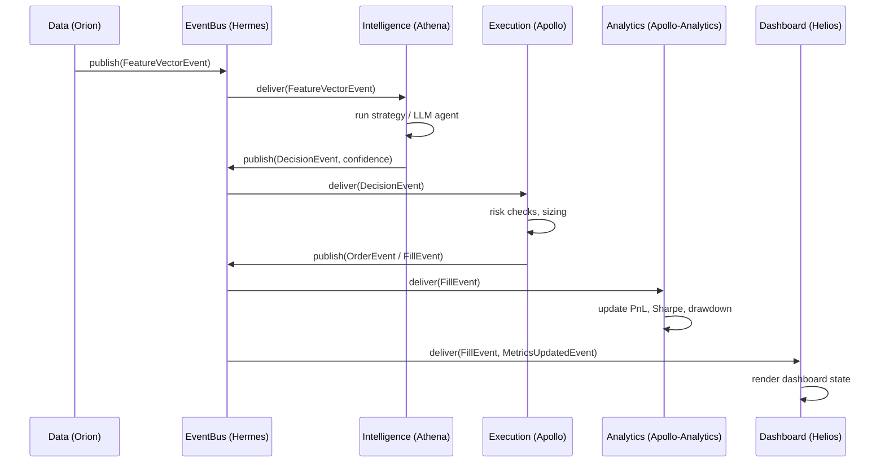
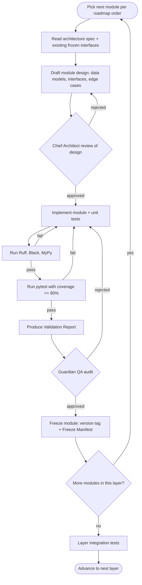
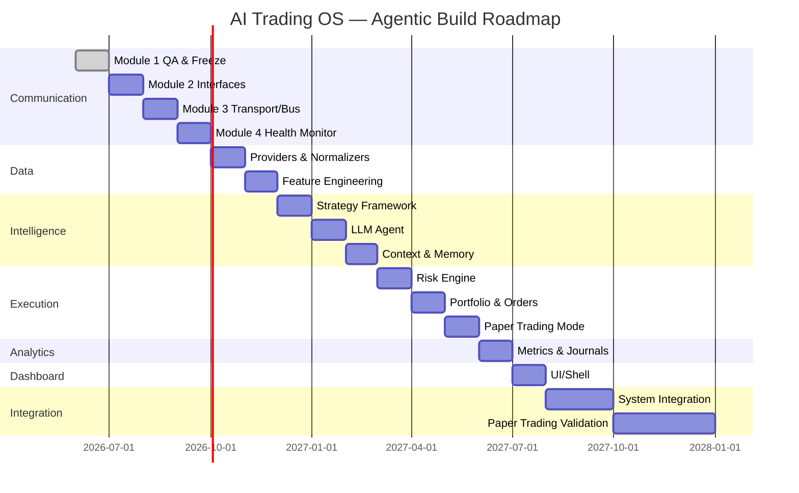

# AI Trading OS — Detailed Build Report & Agentic Execution Architecture

**Purpose of this document:** Expand the Executive Summary into an implementation-ready spec that an autonomous/agentic coding AI (e.g. Claude Code) can consume to continue building the project layer-by-layer, with minimal ambiguity, clear interfaces, acceptance gates, and a self-checking workflow.

**Status baseline (as of this report):** Foundation (Atlas) frozen v1.0.0. Communication (Hermes) Module 1 (immutable models) implemented, entering QA. All other layers: architecture defined, no production code. Overall completion ≈ 25–30%.

---

## 1. System Overview

The AI Trading OS is a seven-layer, event-driven trading platform. Each layer is a bounded context that only depends on layers **below** it and communicates upward/sideways exclusively through the Communication layer's EventBus — never via direct imports across sibling layers. This is the single most important architectural rule for an agent to enforce on every change.

```mermaid
graph TB
    subgraph L1["Layer 1 — Foundation (Atlas) — FROZEN v1.0.0"]
        A1[BaseEvent]
        A2[BasePlugin]
        A3[Logger / Config Manager]
        A4[ID Generation]
        A5[Serialization Helpers]
    end

    subgraph L2["Layer 2 — Communication (Hermes) — IN PROGRESS ~20%"]
        B1["Module 1: Immutable Models (DONE, in QA)"]
        B2["Module 2: Interfaces (i_event_bus, i_scheduler)"]
        B3["Module 3: Transport & EventBus core"]
        B4[Health Monitoring / Heartbeats]
    end

    subgraph L3["Layer 3 — Data (Orion) — PLANNING"]
        C1[Market/News/Sentiment Providers]
        C2[Normalizers & Validators]
        C3[Feature Engineering → FeatureVector]
    end

    subgraph L4["Layer 4 — Intelligence (Athena) — PLANNING"]
        D1[Rule-Based Strategies]
        D2[LLM Agent + Prompt Builder]
        D3[Context & Memory]
        D4["Decision Event (with confidence)"]
    end

    subgraph L5["Layer 5 — Execution (Apollo-Exec) — PLANNING"]
        E1[Risk Engine]
        E2[Order Management]
        E3[Paper / Live Trading Modes]
        E4[Position & Portfolio Tracking]
    end

    subgraph L6["Layer 6 — Analytics (Apollo-Analytics) — PLANNING"]
        F1[Metrics: PnL, Sharpe, Drawdown, Win Rate]
        F2[Journal / Reporting]
    end

    subgraph L7["Layer 7 — Dashboard (Helios) — PLANNING"]
        G1[Command Shell / GUI]
        G2[Live Status + Metrics Views]
    end

    L1 --> L2 --> L3 --> L4 --> L5 --> L6 --> L7
```



### 1.1 Communication contract (the rule an agent must never break)

- All cross-layer data exchange happens via **events** published on the EventBus, defined as immutable dataclasses (`frozen=True, slots=True`) in Communication layer models.
- A layer may **subscribe** to events from any lower layer and **publish** its own events; it may not call another layer's internal functions directly.
- Every event inherits `BaseEvent` from Foundation and carries an `EventMetadata` envelope (id, timestamp, source, correlation id).



---

## 2. Detailed Layer Specifications

For each layer below: **responsibility, inputs/outputs, key event contracts, module breakdown, and acceptance criteria.** An agent should build modules in the listed order within a layer, and layers in the listed top-to-bottom order overall.

### 2.1 Foundation (Atlas) — FROZEN, reference only

| Component | Responsibility |
|---|---|
| `base_event.py` | Abstract `BaseEvent` — id, `event_type`, `timestamp`, `to_dict/from_dict` |
| `base_plugin.py` | Abstract plugin interface all extensible components implement |
| `logger.py` | Structured JSON logging, log level from config |
| `config_manager.py` | Loads YAML/env config, validates schema |
| `constants.py` | Shared constants (as `ClassVar`, not instance fields) |
| `utils.py` | ID generation, time helpers, serialization helpers |

**Agent rule:** Never modify Foundation without an explicit, logged architecture-change approval — it is frozen and every other layer depends on its stability.

### 2.2 Communication (Hermes) — build order

| Module | Contents | Status |
|---|---|---|
| Module 1 — Models | `EventEnvelope`, `Subscription`, `Heartbeat`, `EventMetadata` (immutable dataclasses, `ClassVar` constants) | Done, in QA |
| Module 2 — Interfaces | `IEventBus`, `IScheduler`, `IHealthMonitor` (ABCs / Protocols only, no logic) | Next |
| Module 3 — Transport & Bus | `EventBus` (pub/sub core), `Scheduler`, in-memory + pluggable transport adapter | Planned |
| Module 4 — Health Monitoring | Heartbeat emitters, subscriber liveness checks | Planned |

**Key interfaces (target shape for Module 2):**

```python
class IEventBus(Protocol):
    def publish(self, event: BaseEvent) -> None: ...
    def subscribe(self, event_pattern: str, handler: Callable[[BaseEvent], None]) -> Subscription: ...
    def unsubscribe(self, subscription: Subscription) -> None: ...

class IScheduler(Protocol):
    def schedule(self, interval_seconds: float, callback: Callable[[], None]) -> str: ...
    def cancel(self, job_id: str) -> None: ...
```

**Acceptance criteria for Module 1 freeze (Guardian QA gate):**
- ≥80% unit test coverage on all model classes, including edge cases for `event_pattern` regex validation.
- Ruff/Black/MyPy pass with zero errors.
- Validation Report + Freeze Manifest produced.
- No instance-field leakage from `ClassVar` constants (already fixed — regression test required to lock this in).

### 2.3 Data (Orion)

**Responsibility:** Ingest raw market/news/sentiment data, normalize into a common schema, engineer features, publish `FeatureVectorEvent`.

| Module | Contents |
|---|---|
| Providers | Adapter per source (equities, crypto, news, macro, sentiment) implementing a common `IDataProvider` |
| Normalizers | Convert provider-specific payloads → canonical `MarketTick` / `NewsItem` models |
| Feature Engineering | Rolling stats, technical indicators, sentiment scores → `FeatureVector` |
| Validation | Schema + sanity checks (staleness, out-of-range values, gaps) before publish |

**Key event contracts:**
```python
@dataclass(frozen=True, slots=True)
class FeatureVectorEvent(BaseEvent):
    symbol: str
    timestamp: datetime
    features: dict[str, float]
    source_quality: float  # 0–1 confidence in the underlying data
```

**Acceptance criteria:** provider adapters have contract tests against recorded fixtures (no live network calls in unit tests); normalizer rejects malformed input with typed exceptions, not silent drops; feature engineering module has deterministic, seeded tests.

### 2.4 Intelligence (Athena)

**Responsibility:** Turn `FeatureVectorEvent` (+ optional Memory/Experience context) into a `DecisionEvent` with a confidence score.

| Module | Contents |
|---|---|
| Strategy Framework | `IStrategy` interface; rule-based strategy implementations |
| LLM Agent | Prompt builder (market context + optional experience report) → Claude API call → structured `Decision` parse |
| Context & Memory | Rolling window of recent decisions/outcomes fed back into prompts |

**Key event contract:**
```python
@dataclass(frozen=True, slots=True)
class DecisionEvent(BaseEvent):
    symbol: str
    action: Literal["BUY", "SELL", "HOLD"]
    confidence: float  # 0–1
    rationale: str
    strategy_id: str
```

**Design guardrails for the agent:**
- LLM output must be parsed via strict structured-output prompting (JSON schema) — never regex-scraped free text.
- Keep the inference path stateless and separate from any future training/retraining pipeline (per the "Experience Layer" future-phase note in section 5).
- Every `DecisionEvent` must be reproducible from logged inputs (prompt + feature vector) for audit purposes.

**Acceptance criteria:** strategy unit tests with fixed feature vectors → expected decisions; LLM agent tests use mocked API responses, not live calls; confidence scores validated to be within [0,1] and calibration-tested against a labeled backtest sample once available.

### 2.5 Execution (Apollo — Exec)

**Responsibility:** Convert `DecisionEvent` into risk-checked `OrderEvent`/`FillEvent`, track positions and portfolio state, support paper and live modes.

| Module | Contents |
|---|---|
| Risk Engine | Position limits, margin checks, max-drawdown circuit breaker |
| Order Management | Order lifecycle state machine (`NEW → SENT → FILLED/REJECTED/CANCELLED`) |
| Paper Trading Mode | Simulated fills with configurable slippage/fee model |
| Live Trading Mode | Broker adapter interface (not implemented until paper trading is validated) |
| Portfolio | Position tracking, cash balance, mark-to-market |

**Key event contracts:**
```python
@dataclass(frozen=True, slots=True)
class OrderEvent(BaseEvent):
    symbol: str
    side: Literal["BUY", "SELL"]
    quantity: float
    order_type: Literal["MARKET", "LIMIT"]
    limit_price: float | None
    decision_id: str  # traceability back to DecisionEvent

@dataclass(frozen=True, slots=True)
class FillEvent(BaseEvent):
    order_id: str
    symbol: str
    fill_price: float
    fill_quantity: float
    fees: float
    timestamp: datetime
```

**Acceptance criteria:** risk engine has property-based tests (never emits an order that violates a configured limit); paper-trading fill simulation is deterministic under a fixed seed; **live trading module is explicitly out of scope until paper-trading validation (Section 5) passes** — an agent should refuse to wire up real broker credentials before that gate.

### 2.6 Analytics (Apollo — Analytics)

**Responsibility:** Consume `FillEvent`/`DecisionEvent` streams, compute performance metrics, maintain journal.

| Module | Contents |
|---|---|
| Metrics Engine | Returns, Sharpe, max drawdown, win rate, exposure |
| Journal | Append-only trade log with rationale references back to `DecisionEvent` |
| Reporting | End-of-day report generation |

**Acceptance criteria:** metrics computed against known reference datasets match expected values within tolerance; journal is append-only and tamper-evident (hash-chained entries recommended).

### 2.7 Dashboard (Helios)

**Responsibility:** Present system state — positions, recent decisions, metrics, health — read-only consumer of events.

| Module | Contents |
|---|---|
| Shell/CLI | Terminal-based live view (first milestone) |
| Web GUI | Optional later milestone |
| Plugin Adapters | Custom widget/view extension points |

**Acceptance criteria:** Dashboard has zero write-paths into other layers — it only subscribes to events. This should be enforced with an import-linter rule in CI.

---

## 3. Agentic Build Workflow

This section defines how an agentic AI should operate to build each remaining module safely and verifiably.



### 3.1 Roles (map to agent personas or CI gates)

| Role | Responsibility |
|---|---|
| **Hermes-style module owner** | Implements the module per spec, writes unit tests, documents public API |
| **Guardian (QA)** | Audits code + docs, verifies static analysis and tests pass on a clean clone, checks public API against architecture spec, approves/rejects freeze |
| **Chief Architect** | Approves module freezes, reviews cross-layer compliance, manages scope creep, updates roadmap after each freeze |

An agentic pipeline can implement these as three sequential automated stages (build → static/test gate → architecture-compliance gate) with a human-in-the-loop checkpoint at "Freeze."

### 3.2 Non-negotiable engineering standards

- **Language/runtime:** Python 3.11, Linux (Ubuntu), virtualenv or Docker.
- **Immutability:** All cross-layer event models are `@dataclass(frozen=True, slots=True)`; true constants use `ClassVar`, never plain class attributes (this was a real bug already fixed once — regression-test it).
- **Style/type checks:** Ruff + Black on every commit; MyPy strict mode where feasible.
- **Testing:** PyTest, ≥80% coverage per module, fixtures for sample data, deterministic seeds for any simulation.
- **No live network calls in unit tests** — provider/broker adapters must be mockable via dependency injection.
- **No cross-layer imports** — enforce with an import-linter / architecture-test that fails CI if e.g. `execution` imports from `intelligence` directly instead of via events.
- **Every commit that touches a frozen layer requires explicit sign-off** — treat frozen code as append-only from other layers' perspective.

---

## 4. CI/CD Pipeline (GitHub Actions target shape)

```yaml
name: python-ci
on: [push, pull_request]
jobs:
  quality:
    runs-on: ubuntu-latest
    steps:
      - uses: actions/checkout@v4
      - uses: actions/setup-python@v5
        with:
          python-version: "3.11"
      - run: pip install -r requirements-dev.txt
      - run: ruff check .
      - run: black --check .
      - run: mypy src/
      - run: pytest --cov=src --cov-report=term-missing --cov-fail-under=80
      - run: python scripts/architecture_lint.py   # blocks illegal cross-layer imports
```

Logs → `logs/` as structured JSON; health checks emit heartbeats via the Communication layer; production log aggregation (ELK/cloud logging) is a later-phase item, not required for the current build stage.

---

## 5. Testing & Validation Strategy

| Phase | Scope | Gate to advance |
|---|---|---|
| Unit tests | Per-module, 80–100% coverage | All green + static analysis clean |
| Integration tests | Cross-module within a layer, then cross-layer via EventBus | End-to-end flow from Data → Intelligence → Execution runs on mocked data |
| Simulation (paper trading) | Full pipeline on live delayed data, no real orders | Weeks-to-months of stable paper trading, metrics within expected bounds |
| Live trial | Small real-capital pilot | Only after paper trading validation *and* explicit compliance/risk sign-off |

**Explicit warning for the agent:** offline/backtest results systematically understate real risk (industry consensus, cited in the source report). Do not treat backtest performance as sufficient justification to enable live trading.

---

## 6. Risk Register (carried forward + expanded)

| Risk | Likelihood | Impact | Mitigation |
|---|---|---|---|
| Data quality | High | High | Provider-level validation, redundancy, staleness checks, `source_quality` field surfaced downstream |
| Model/strategy failure | Medium | Severe | Extensive backtesting + paper trading before any live capital; confidence-score gating |
| Technical debt | High | Medium | Strict CI gates (Ruff/Black/MyPy/coverage), architecture-lint for layer boundaries |
| Resource slippage | Medium | High | Biweekly progress review against roadmap; re-estimate after each layer freeze |
| Regulatory compliance | Low | Medium | Audit trails via journal; segregate paper vs live trading paths at the type level |
| Security/credential breach | Medium | High | Secrets management (never hardcoded), broker adapters isolated behind an interface, security review gate before live wiring |
| LLM prompt-injection / bad decisions from adversarial data | Medium | High | Sanitize/validate all external text (news/sentiment) before it reaches the LLM prompt; structured-output parsing only |

---

## 7. Roadmap (agent-executable milestone order)

1. **Communication Module 1** — finish QA, freeze v1.0.0 *(near-term, in progress)*
2. **Communication Module 2** — interfaces (`IEventBus`, `IScheduler`)
3. **Communication Module 3** — EventBus core + transport + scheduler implementation
4. **Communication Module 4** — health monitoring / heartbeats → **Communication layer freeze**
5. **Data (Orion)** — providers → normalizers → feature engineering → layer freeze
6. **Intelligence (Athena)** — strategy framework → LLM agent → context/memory → layer freeze
7. **Execution (Apollo-Exec)** — risk engine → order management → paper trading mode → portfolio → layer freeze
8. **Analytics (Apollo-Analytics)** — metrics engine → journal → reporting → layer freeze
9. **Dashboard (Helios)** — shell/CLI → plugin adapters → (optional) web GUI → layer freeze
10. **System integration** — full pipeline end-to-end test on mocked/replayed data
11. **Paper trading validation** — extended real (delayed) data run, target mid-2027 per original estimate
12. *(Future phase, out of current scope)* Experience Layer / continual learning, SaaS/licensing, live broker integration, compliance certifications (SOC 2)



---

## 8. Definition of Done (per module, restated for the agent)

A module is **frozen** only when all of the following are true:
1. Implementation complete for all planned submodules.
2. Unit test suite complete, coverage ≥80%, all tests green.
3. Ruff, Black, MyPy pass with zero errors on a clean clone.
4. Validation Report produced (design, interfaces, test results, deviations).
5. Freeze Manifest produced (versioned release notes).
6. Architecture-lint confirms no illegal cross-layer imports were introduced.
7. Guardian QA sign-off recorded.
8. Chief Architect freeze approval recorded.

Only after these 8 conditions are met should the agent begin the next module or layer.

---

## 9. Suggested Repository Structure

```
src/
  foundation/            # frozen — reference only
  communication/
    models/              # Module 1 (frozen)
    interfaces/           # Module 2
    bus/                  # Module 3
    health/                # Module 4
  data/
    providers/
    normalizers/
    features/
  intelligence/
    strategies/
    llm_agent/
    memory/
  execution/
    risk/
    orders/
    paper_trading/
    portfolio/
  analytics/
    metrics/
    journal/
    reports/
  dashboard/
    shell/
    web/
    plugins/
scripts/
  test.py
  architecture_lint.py
config/
  *.yaml
data_store/
logs/
.github/workflows/python-ci.yml
```

---

## 10. Sources

- Project documentation and internal architect/QA communications (Hermes, Guardian) provided by the user, including the Communication Layer Module 1 reports.
- Public references cited in the original Executive Summary: QuantFlow (event-driven trading framework write-up), FinRL-X (arXiv paper on modular AI trading infrastructure), Confluent's Event-Driven Architecture guide, and an IPM-style project risk matrix guide.
